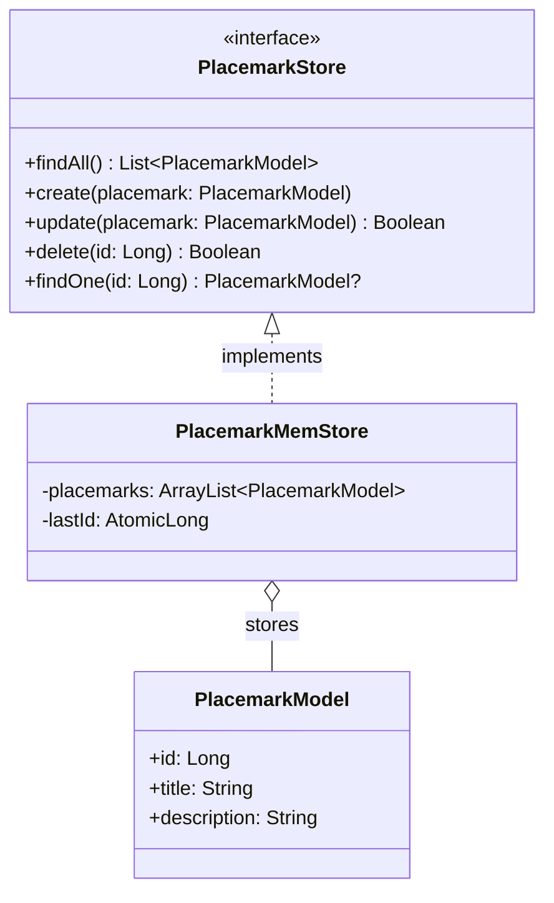

# Placemark – UML Class Diagram (Lab 1)

```mermaid
classDiagram
    class PlacemarkModel {
        +id: Long
        +title: String
        +description: String
    }

    class PlacemarkStore {
        <<interface>>
        +findAll() List~PlacemarkModel~
        +create(placemark: PlacemarkModel)
        +update(placemark: PlacemarkModel) Boolean
        +delete(id: Long) Boolean
        +findOne(id: Long) PlacemarkModel?
    }

    class PlacemarkMemStore {
        -placemarks: ArrayList~PlacemarkModel~
        -lastId: AtomicLong
    }

    PlacemarkStore <|.. PlacemarkMemStore : implements
    PlacemarkMemStore o-- PlacemarkModel : stores
```